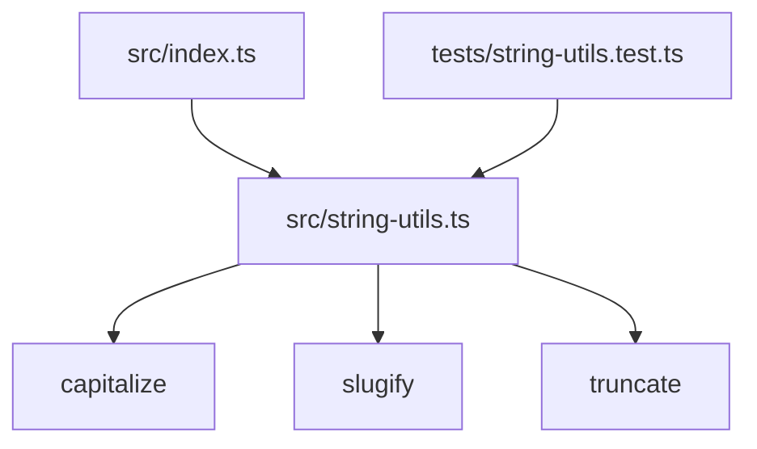

# Architecture

This project is a TypeScript utility library providing string manipulation functions.

## Project Structure

```
string-utils/
├── src/
│   ├── index.ts              # Public API exports
│   └── string-utils.ts       # Core utility functions
├── tests/
│   └── string-utils.test.ts  # Unit tests
├── dist/                     # Compiled output (generated)
├── .husky/                   # Git hooks
├── package.json              # Dependencies and scripts
├── tsconfig.json             # TypeScript configuration
└── eslint.config.js          # Linting rules
```

The project is a single-package library with no monorepo structure. The entry point is `src/index.ts`, which re-exports functions from `src/string-utils.ts`.

## Architectural Pattern

This project follows a **simple module pattern** suitable for small utility libraries.

Key design principles:
- **Single responsibility**: Each function performs one string transformation
- **Pure functions**: All utilities are stateless and side-effect-free
- **Named exports**: Explicit API surface with no default exports
- **Type safety**: Full TypeScript strict mode enforcement

This pattern suits the project because:
- The library has a narrow, well-defined scope (string utilities)
- No external dependencies or state management required
- Functions are independent and composable
- Simple testing and maintenance

## Component Diagram



## Directory Organization

The project uses a flat source structure:
- `src/` contains all source code
- `tests/` contains test files mirroring the source structure
- No subdirectories or layer boundaries within `src/`

As the library grows, consider organizing by feature domain:
```
src/
├── case/          # capitalize, camelCase, etc.
├── formatting/    # truncate, pad, wrap
└── url/           # slugify, encode, etc.
```

## Data Flow

All functions follow the same flow:

1. **Input**: Caller invokes function with string and optional parameters
2. **Validation**: Function checks for edge cases (empty strings, invalid lengths)
3. **Transformation**: Pure computation on the input string
4. **Output**: Return transformed string

Example for `slugify`:
```typescript
slugify('Hello World!')
  → toLowerCase()
  → replace non-alphanumeric with '-'
  → trim leading/trailing '-'
  → return 'hello-world'
```

## External Dependencies

This project has zero runtime dependencies. All devDependencies are build-time tools:
- **TypeScript**: Type checking and compilation
- **Vitest**: Test runner
- **ESLint**: Linting
- **Husky**: Git hooks for pre-commit checks

## Testing Strategy

- **Unit tests**: Each function has dedicated test cases covering normal and edge cases
- **Test location**: Separate `tests/` directory mirroring `src/` structure
- **Test naming**: `*.test.ts` suffix
- **Runner**: Vitest with `npm test`

## Build and Distribution

- **Compiler**: TypeScript (`tsc`)
- **Output**: `dist/` directory with `.js`, `.d.ts`, and `.map` files
- **Module format**: ESNext (ESM only, specified by `"type": "module"` in package.json)
- **Entry point**: `dist/index.js`

## Architecture Decision Records

### ADR-001: Use Named Exports Only

**Status**: Accepted

**Context**: The library needs a clear, predictable API for consumers. Default exports can cause inconsistent naming across codebases.

**Decision**: Use only named exports. The main `index.ts` re-exports all public functions by name.

**Rationale**: Named exports provide better IDE autocomplete, easier refactoring, and consistent naming across all consumers.

**Consequences**: Consumers must use `import { capitalize } from 'string-utils'` rather than `import capitalize from 'string-utils'`. This is a minor ergonomic trade-off for better maintainability.

### ADR-002: Pure Functions with No Dependencies

**Status**: Accepted

**Context**: String utilities are foundational code that may be used in many contexts. Adding dependencies increases bundle size and maintenance burden.

**Decision**: Implement all functions as pure, dependency-free utilities using only JavaScript standard library.

**Rationale**: Zero dependencies means zero security vulnerabilities from third-party code, minimal bundle size, and maximum portability.

**Consequences**: Some advanced features (e.g., Unicode normalization, locale-aware transformations) may require more manual implementation. This is acceptable for the current scope.

### Template for Future ADRs

```markdown
### ADR-NNN: [Title]

**Status**: Proposed | Accepted | Deprecated | Superseded by ADR-XXX

**Context**: What is the issue that we're seeing that is motivating this decision?

**Decision**: What is the change that we're proposing and/or doing?

**Rationale**: Why is this the best choice given the constraints?

**Consequences**: What trade-offs does this decision introduce?
```
